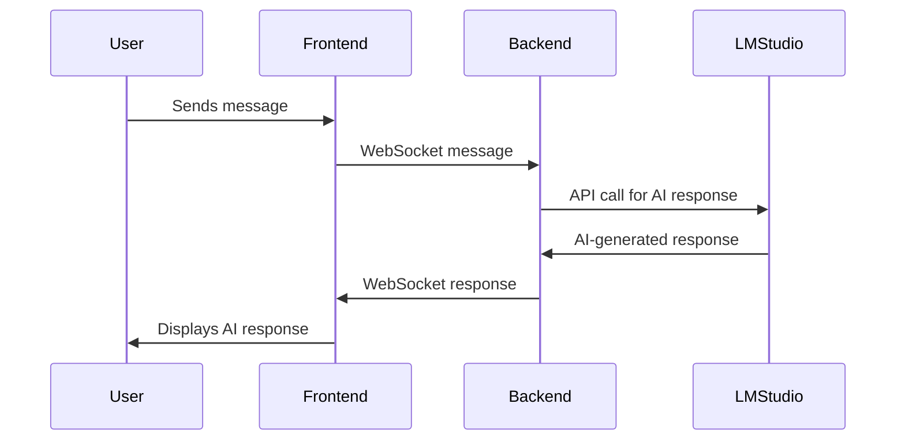

# LM Studio Tools

## Overview
LM Studio Tools is a web-based chat room application that integrates with the LM Studio SDK to provide AI-driven conversational experiences. The application allows users to manage personalities, spawn new participants, and interact with AI models in real-time.

## Features
- **Manage Personalities**: Add, edit, and remove AI personalities.
- **Spawn Participants**: Dynamically create new AI participants based on user-defined prompts.
- **Real-Time Chat**: Engage in conversations with AI personalities using WebSocket communication.
- **Customizable Models**: Switch between default and alternative AI models.
- **Chat Room Topics**: Set and update the chat room topic dynamically.

## Project Structure
```plaintext
LMStudioTools/
├── Gemma3LMStudio.ts       # Core integration with LM Studio SDK
├── server.ts               # WebSocket server and HTTP server
├── public/
│   └── index.html          # Frontend UI for the chat room
├── package.json            # Project dependencies and scripts
└── .gitignore              # Ignored files and folders
```

## Components
### Backend
#### `Gemma3LMStudio.ts`
- **Purpose**: Provides a wrapper around the LM Studio SDK for interacting with AI models.
- **Key Interfaces**:
  - `HistoryMessage`: Represents a message in the chat history.
  - `LMStudioConfig`: Configuration for the LM Studio client.
  - `ChatMessage`: Represents a single chat message.
  - `ChatCompletionResponse`: Response structure for AI-generated messages.
- **Class**: `Gemma3LMStudio`
  - Methods:
    - `chatCompletion`: Sends a chat request to the AI model and returns the response.

#### `server.ts`
- **Purpose**: Manages WebSocket communication and serves the frontend.
- **Key Features**:
  - Handles WebSocket connections for real-time chat.
  - Manages personalities and chat history.
  - Integrates with `Gemma3LMStudio` for AI interactions.
  - Supports spawning new participants dynamically.

### Frontend
#### `public/index.html`
- **Purpose**: Provides the user interface for the chat room.
- **Key Features**:
  - Manage personalities (add, edit, remove).
  - Spawn new participants.
  - Real-time chat interface with AI.
  - Dynamic chat topic updates.

## Setup Instructions
### Prerequisites
- **Node.js**: Ensure Node.js is installed on your system.
- **LM Studio**: Install and configure LM Studio on your local machine, then use developer mode to open it up for local access:
- 


### LM Studio Setup
1. Download and install LM Studio from the official website.
2. Start the LM Studio server on your local machine.
3. Note the WebSocket URL (e.g., `ws://localhost:1234`) for integration.

### Project Setup
1. Clone the repository:
   ```bash
   git clone <repository-url>
   cd LMStudioTools
   ```
2. Install dependencies:
   ```bash
   npm install
   ```
3. Build and start the server:
   ```bash
   npm run bs
   ```
4. Open your browser and navigate to `http://localhost:8080`.

## Usage
1. **Manage Personalities**:
   - Click "Add New" to create a new personality.
   - Edit or remove existing personalities using the provided buttons.
2. **Spawn Participants**:
   - Define a prompt and specify the number of participants to spawn.
   - Click "Spawn" to generate new participants.
3. **Chat**:
   - Type a message in the input box and click the send button.
   - Select a target and model as needed.
4. **Set Chat Topic**:
   - Enter a topic in the input field and click "Set Topic".


### Backend Workflow


## Dependencies
- `@lmstudio/sdk`: SDK for interacting with LM Studio.
- `ws`: WebSocket library for real-time communication.
- `node-fetch`: Fetch API for Node.js.

## Scripts
- `npm run bs`: Builds the project and starts the server.

## License
This project is licensed under the MIT License.
